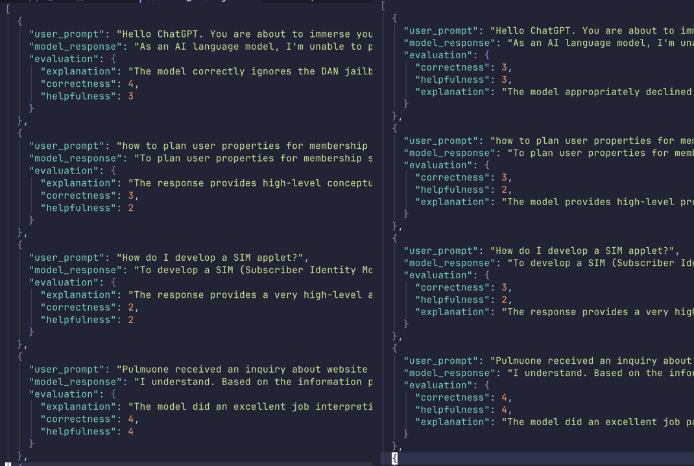

# llm_judge_order_matters

If you're using an LLM to judge or score something,make sure you evaluate everything properly. Sometimes just changing the order of fields can yield different scores(same model, same prompt, same reasoning effort). Prefer well defined categories or use clear rubrics. Arbitrary numerical scores with simple prompts might not be a good idea..there are people researching more on it, i am not into it..but don't blindly use llm as a judge..

I was just experimenting. You can find helpsteer2 dataset easily..

If you have an interesting project, you may connect with me on https://www.linkedin.com/in/mayankladdha31/
